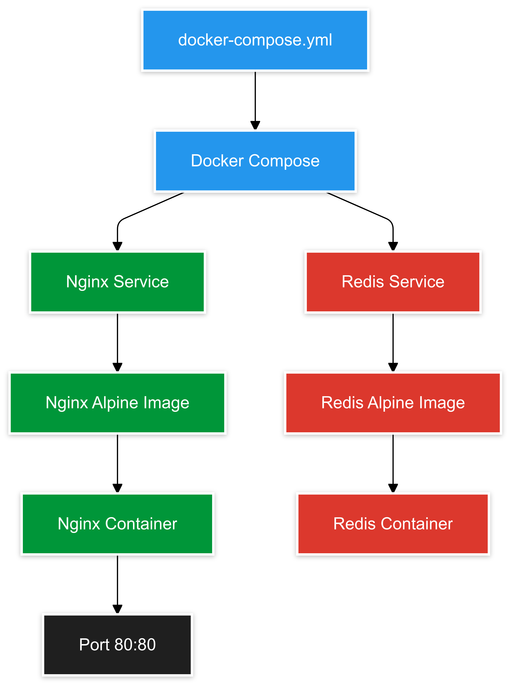

# 🐳 Docker Compose Mastery: Multi-Container Orchestration

[](https://github.com/TheToriqul/docker-compose-intro)


## 📋 Project Overview

This project demonstrates my expertise in orchestrating multi-container applications using Docker Compose. Through hands-on implementation, I've created a practical example that showcases the power of container orchestration, focusing on the seamless integration of Nginx and Redis services.

## 🎯 Key Objectives

- Master Docker Compose for multi-container application management
- Implement microservices architecture using industry-standard containers
- Configure and manage service interconnections and networking
- Deploy scalable container solutions with proper port mapping
- Establish efficient container orchestration workflows

## 🏗️ Project Architecture

The project implements a microservices architecture with two main services:

<figure >
  <p align="center">
      
      <p align="center">🐳 Docker Compose Mastery Architecture: Multi-Container Orchestration</p> 
  </p>
</figure>

## 💻 Technical Stack

- **Container Orchestration**: Docker Compose v3.8
- **Web Server**: Nginx Alpine
- **Cache Service**: Redis Alpine
- **Network**: Built-in Docker Compose networking
- **Configuration**: YAML-based service definitions

## 🚀 Getting Started

<details>
<summary>🐳 Prerequisites</summary>

- Docker Engine 20.10.0+
- Docker Compose v2.0.0+
- Basic understanding of YAML configuration
- Terminal access (bash/zsh)

</details>

<details>
<summary>⚙️ Installation</summary>

1. Clone the repository:
   ```bash
   git clone https://github.com/TheToriqul/docker-compose-intro.git
   ```
2. Navigate to the project directory:
   ```bash
   cd docker-compose-intro
   ```
3. Review the docker-compose.yml configuration:
   ```yaml
   version: '3.8'
   services:
     web:
       image: nginx:alpine
       ports:
         - "80:80"
     redis:
       image: redis:alpine
   ```

</details>

<details>
<summary>🎮 Usage</summary>

1. Start the services:
   ```bash
   docker-compose up --build -d
   ```
2. Verify deployment:
   ```bash
   docker-compose ps
   ```
3. Access the Nginx service:
   ```bash
   curl localhost
   ```
4. Stop and clean up:
   ```bash
   docker-compose down
   ```

For detailed commands and operations, refer to the [reference-commands.md](reference-commands.md) file.

</details>

## 💡 Key Learnings

### Technical Mastery:
1. Docker Compose configuration and syntax
2. Multi-container orchestration strategies
3. Service networking and communication
4. Container lifecycle management
5. Infrastructure as Code principles

### Professional Development:
1. Microservices architecture implementation
2. System design and service integration
3. DevOps best practices
4. Configuration management
5. Service scalability planning

## 🔄 Future Enhancements

<details>
<summary>View Planned Improvements</summary>

1. Add custom Nginx configuration
2. Implement Redis persistence
3. Add monitoring and logging services
4. Create development and production configurations
5. Implement service scaling
6. Add health checks and recovery procedures

</details>

## 📧 Connect with Me

- 📧 Email: toriqul.int@gmail.com
- 📱 Phone: +65 8936 7705, +8801765 939006
- 🌐 LinkedIn: [@TheToriqul](https://www.linkedin.com/in/thetoriqul/)
- 🐙 GitHub: [@TheToriqul](https://github.com/TheToriqul)
- 🌍 Portfolio: [TheToriqul.com](https://thetoriqul.com)

## 👏 Acknowledgments

- [Poridhi](https://devops.poridhi.io/) for providing comprehensive learning resources
- Docker documentation for excellent reference materials
- The open-source community for continuous inspiration

---

Thank you for exploring my Docker Compose project! I hope you find it informative and useful for your own container orchestration journey. 🚀